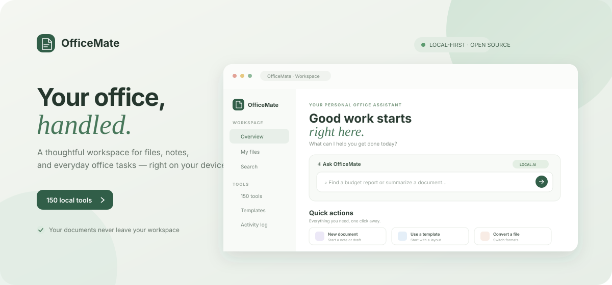
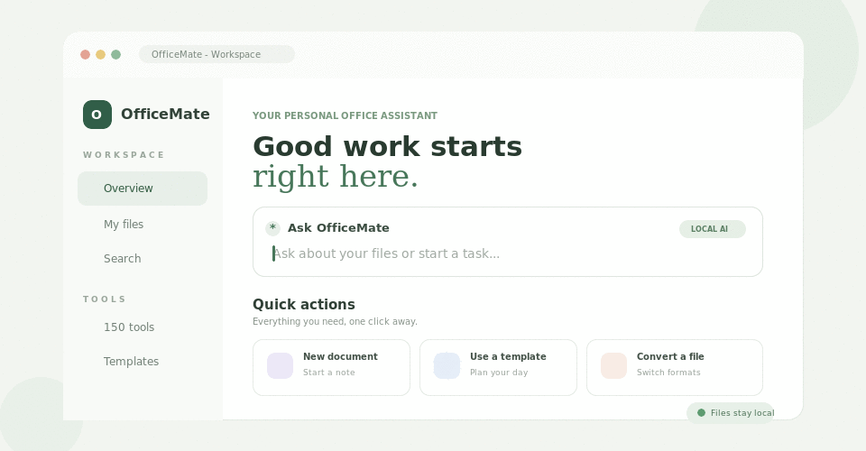

<div align="center">
  <h1>OfficeMate</h1>
  <p><strong>Your office, handled.</strong><br>A local-first workspace for documents, spreadsheets, notes, and everyday file tasks.</p>
  <p>
    
    
    
    
  </p>
</div>

<p align="center">
  
</p>

OfficeMate is a free, open-source office assistant for Word, Excel, PowerPoint, PDF, CSV, Markdown, and text files. It runs on your own machine, has no paid API dependency, and keeps managed documents inside a workspace folder. The dashboard, notes, search, and many file and text utilities work with Python's standard library; free optional packages add native Office and PDF support.

## Preview

<p align="center">
  
  <br><sub>A small illustrative UI animation—not a screen recording.</sub>
</p>

## Highlights

- **150 searchable tools** for files, text, CSV, and Office documents.
- **Local by design:** documents are not uploaded to an external service.
- **Useful dashboard:** browse and preview files, create notes, search readable content, and start from templates.
- **Safer file operations:** confirmations for destructive actions, backups before in-place Office edits, a local trash, and an activity log.
- **Extensible without a service account:** optional features use free Python packages and LibreOffice.

## Get started

```bash
python app.py
```

Open <http://localhost:8765>. To choose a different workspace folder or port:

```bash
OFFICEMATE_WORKSPACE=/path/to/folder OFFICEMATE_PORT=8765 python app.py
```

The server also honors the `PORT` environment variable. By default, files are managed in `./workspace`; backups, trash, metadata, and the audit trail are stored locally alongside the workspace.

> **Network safety:** OfficeMate binds to `0.0.0.0` for local-network and preview access and has no authentication. Use it only on a trusted network; do not expose it to the public internet.

### Optional Office and PDF support

The app itself runs with Python's standard library. Install the optional Python packages to enable additional document actions:

```bash
pip install -r requirements.txt
```

Install [LibreOffice](https://www.libreoffice.org/) separately to enable document conversion and batch PDF export. Without the optional packages, the dashboard, notes, Markdown, CSV processing, and file search still work; tools explain when a dependency is missing.

## What you can do

| Category | Tools | Examples |
| --- | ---: | --- |
| **Files** | 33 | Organize, rename, tag, pin, back up, restore, checksum, find duplicates, search content, create ZIPs, and export inventory or activity reports. |
| **Text** | 43 | Count and summarize text; extract or redact common data; clean, compare, merge, sort, wrap, and transform text or Markdown. |
| **CSV** | 37 | Inspect, clean, filter, sort, split, merge, reshape, validate, and summarize data; convert CSV to JSON or Markdown. |
| **Office** | 37 | Create, inspect, extract, merge, and edit Word, Excel, and PowerPoint files; inspect PDFs and convert supported formats. |

The searchable **150 tools** page builds its forms from the registered actions. Changes that rename, clear, delete, or edit existing content require confirmation. Office documents are backed up before in-place edits; most transformations create a separate output file. ZIP extraction blocks path traversal and limits archive size and entry count.

The dashboard also includes meeting and project note templates, an expense CSV template, file previews, a local command bar for file search and extractive summaries, and a file organizer. The command bar is not a connection to a hosted AI service; local-LLM integration is not included.

### Optional dependencies

`requirements.txt` includes `python-docx` (Word), `openpyxl` (Excel), `python-pptx` (PowerPoint), `pypdf` (PDF reading), and `pandas` (data support). LibreOffice is installed separately for format conversion. Each capability remains optional.

## Where your data lives

- **Workspace files:** `./workspace` (or the directory set with `OFFICEMATE_WORKSPACE`).
- **Backups:** `./workspace/.backups`.
- **Deleted files:** local hidden trash inside the workspace.
- **Metadata:** a hidden workspace sidecar file.
- **Audit trail:** `./workspace/.officemate-audit.jsonl`.

OfficeMate does not send documents to an external service. Since the server has no login or authentication, keep it on a trusted machine/network and protect access to the workspace itself.

## Current scope

OfficeMate is an extensible local-first foundation. Voice input, scheduled reports, and local-LLM integration are not included yet.

## License

[MIT](LICENSE)
